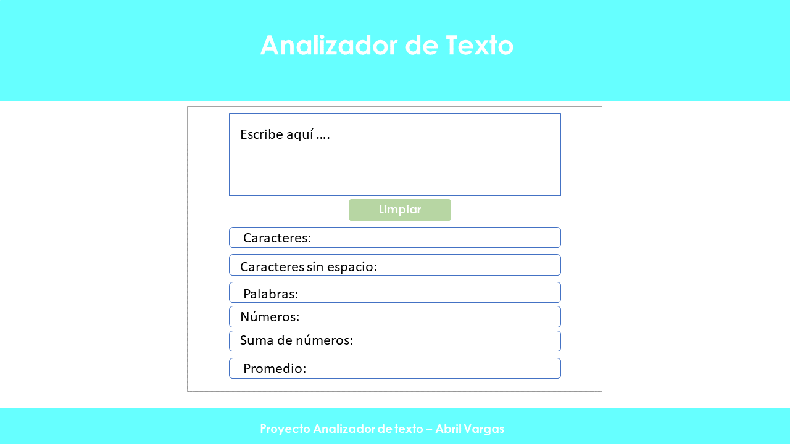
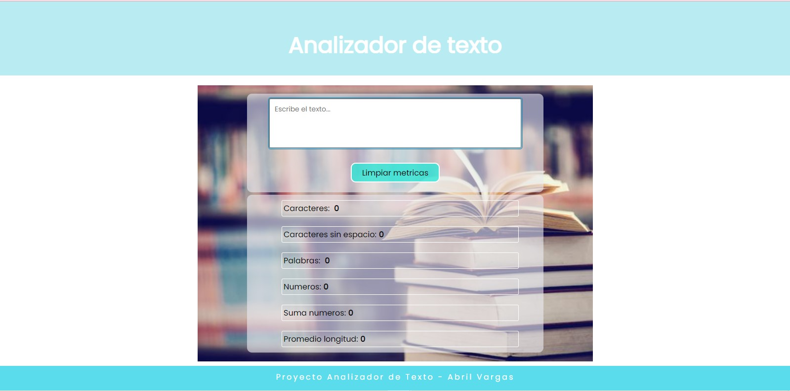

# PROYECTO TEXT ANALYZER
## Objetivo del Proyecto
* Desarrollar una calculadora de texto que permita mostrar al usuario las métricas de palabras,espacios,números,suma de números y el promedio de la cadena de texto.
* Dentro del desarrollo del proyecto se debe utilizar HTML semántico, CSS y Javascript.

## Prototipo de baja fidelidad
* Con el objetivo de implementar los requimientos solicitados en el proyecto y uso de especificaciones dentro del HTML Y CSS se opto por un diseño sobrio que le permita al usuario poder visualizar de manera clara la información.
* Mostrando los datos en tiempo real una vez que se esta tecleando la cadena de texto en el textarea.

## Interfaz de Usuario

## 1. HTML

* Encabezado
* Titulo con la etiqueta h1
* textarea
* boton para limpiar el textarea
* lista donde muestra las métricas
* pie de página/Autor

## 2. Estilos CSS

* Uso de flexbox
* Paleta de colores claros
* Efecto hover en boton
* background-image 
* listas `<ul>`
* box model para dar estilos a las listas

## 3. Funcionamiento Javascript

* Declaración de variables con `let` y `const`
* Uso de eventos con `Event Listener` y `keyup` para al momento de teclear el texto dentro del  `texarea`.
* Manipulacion de selectores en el `DOM` querySelector y 
getElementById.   
* Uso de `if..else`, `for` y  `array`
* uso de los metodos para manipular strings como `split`, `trim` o `replace`.
* Uso de módulos ECMAScrip  `import` y  `export`

## Deacuerdo a lo anterior dare una breve explicación de algunos conceptos.

**Métodos de JAVASCRIPT**

	• Trim() = elimina los espacios en blanco en ambos extremos del string.
	• Split() = división de cadenas de textos (string) empleando un separador que puede ser solo un carácter, otra cadena o una expresión regular
	• Replace()= reemplaza parte de una cadena de texto, basándose en el número de caracteres especificados, con otra cadena de texto.

**Evento EventListener**
	•  Registra un evento a un objeto en específico.

**Evento keyup**

	• ¿Qué es keyup? Es un evento que se ejecuta cuando la tecla deja de estar abajo (o sea, cuando soltamos la tecla).

**Manipulación del Web API** 

**DOM**

	• El querySelector()método devuelve el primer elemento que coincide con un selector CSS.
	 El getElementById()método de la Documentinterfaz devuelve un Elementobjeto que representa el elemento cuya id propiedad coincide con la cadena especificada.

**Inner HTML**

	• La innerHTML propiedad establece o devuelve el contenido HTML (HTML interno) de un elemento

**Textcontent**

	• La textContent propiedad establece o devuelve el contenido de texto del nodo especificado y todos sus descendientes .

**Nodo:** cualquier etiqueta del cuerpo dentro del árbol del DOM.

**Expresiones Regulares**

	• Las expresiones regulares son patrones utilizados para encontrar una determinada combinación de caracteres dentro de una cadena de texto. En JavaScript, las expresiones regulares también son objetos.
**Ejemplo:**

                      
                             split(/\s+/);

 Dividimos la cadena con la /\s+/ expresión regular, lo que   significa uno o más caracteres de     espacio en blanco.

**Módulos de ECMAScript (Módulos ES)**

	• A partir de ECMAScript se introduce una característica nativa 
	denominada Módulos ES (ESM), que permite la importación y 
	exportación de fragmentos de datos entre diferentes 
	ficheros Javascript.
	
**Import y export**

Para poder utilizar los módulos es necesario con la instalación
 de node.js en nuestro proyecto para que los ficheros puedan
  ser utilizados en otros fragmentos de código.

	• Export
Con un export puedes exportar todo tipo de piezas de software, 
como datos en variables de tipos primitivos, funciones, objetos, clases.
**Ejemplo:**

                       export default analyzer;

    

•Import

En el momento que queramos cargar alguna cosa de un módulo externo, usaremos la sentencia import.
**Ejemplo:**

                   import analyzer from './analyzer.js';

Como llamar al objeto desde analyzar.js para utilizar las funciones en  import  index.js

Se declara una variable que almacene el valor contenido el función para mostrar los resultados mediante la manipulación del DOM.
**Ejemplo:**

             const countWords = analyzer.getWordCount(text);

## Herramientas Adicionales 

* Instalación de Git
* Cuenta de usuario de Github
* Configuración de la key SSH
* Clonar repositorio DEV009-text-analyzer
* Instalacion de Node.js
* Correr npm rum start
* Pruebas de desarrollo(test) playwright 

## Pruebas de criterios mínimos de aceptación
1. npm run test:oas-html
2. npm run test:oas-css
3. npm run test:oas-web-api
4. npm run test:oas-js

## Pruebas unitarias (unit tests)
1. npm run test

## Pruebas end-to-end

1. npm run test:e2e

## Conclusion 

De acuerdo con lo anterior y los criterios solicitados de la aplicación web **analizador de texto**, logre entender conceptos de temas sobre Javascript que mediante la investigación y la practica pude ir entendiendo y abordando. El principal reto de este proyecto fue entender la logica del flujo de información y como se debería ir resolviendo las etapas del proyecto, para esto la estrategía implemetada fue llevar un control de puntos en específico que deseaba entender e ir por pasos hasta llegar al funcionamiento del la página  web.

El diseño final tomando encuenta la interación con el usuario y el diseño UX, escogi colores primarios que fueran accesibles a la vista y que la información se desplegara en un solo momento y se visualizara de madera optima. 

